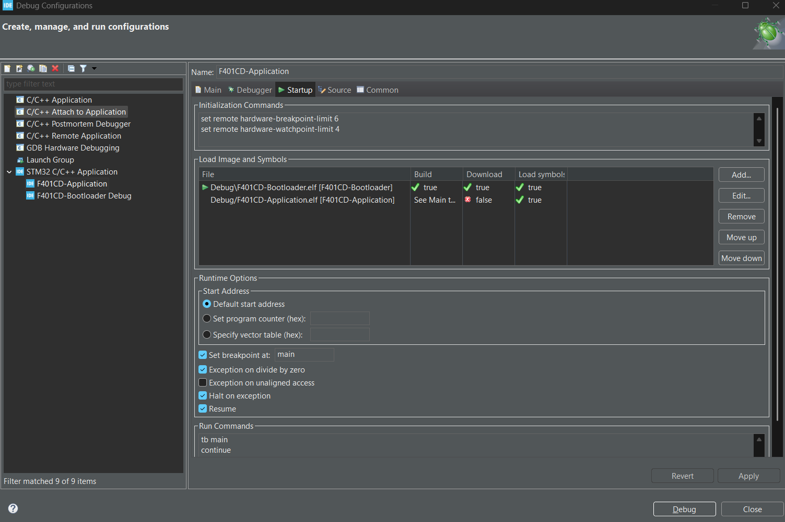

# STM32F401 XMODEM Bootloader

**Target:** STM32F401CD | **Interface:** UART XMODEM | **IDE:** STM32CubeIDE

# Hardware
https://github.com/WeActStudio/WeActStudio.MiniSTM32F4x1

---

## 1. Overview

A UART-based XMODEM bootloader for the STM32F401CD microcontroller. The bootloader resides in Sector 0 and accepts firmware updates over UART. After a successful transfer it validates the application and jumps to it automatically.

```
[ Host PC (Python / Tera Term) ]
         |
         | UART XMODEM (115200 8N1)
         v
[ Bootloader  0x08000000 - 0x08003FFF ]
         |
         | Validates SP + PC
         v
[ Application 0x08004000 - 0x0807FFFF ]
```

### Flash Memory Map (STM32F401CD — 256 KB)

| Region | Start | End | Size | Sector |
|---|---|---|---|---|
| Bootloader | `0x08000000` | `0x08003FFF` | 16 KB | Sector 0 |
| Application | `0x08004000` | `0x0803FFFF` | 240 KB | Sector 1–5 |
| (Reserved) | `0x08040000` | `0x0807FFFF` | — | Sector 6–7 |

---

## 2. Project Setup

Create two separate projects in STM32CubeIDE:

| Project | Purpose |
|---|---|
| `F401CD-Bootloader` | Receives firmware via XMODEM, validates and jumps to app |
| `F401CD-Application` | Main application firmware — flashed via XMODEM |

### 2.1 Bootloader — Linker Script

Edit `STM32F401RETx_FLASH.ld` in the Bootloader project:

```ld
MEMORY
{
  FLASH (rx)  : ORIGIN = 0x08000000, LENGTH = 16K   /* Sector 0 only */
  RAM   (xrw) : ORIGIN = 0x20000000, LENGTH = 96K
}
```

### 2.2 Application — Linker Script

Edit the linker script in the Application project:

```ld
MEMORY
{
  FLASH (rx)  : ORIGIN = 0x08004000, LENGTH = 240K  /* Sector 1–5 */
  RAM   (xrw) : ORIGIN = 0x20000000, LENGTH = 96K
}
```

### 2.3 Application — Vector Table Offset

In the Application project, open `system_stm32f4xx.c` and set:

```c
#define VECT_TAB_OFFSET  0x4000U   /* Must match APP_START_ADDR offset */
```

> ⚠️ If `VECT_TAB_OFFSET` is not set, interrupts will be routed to the bootloader vector table causing hard faults or unexpected behavior in the application.

---

## 3. Bootloader Source

### 3.1 Key Defines (`bootloader.h`)

```c
#define APP_START_ADDR        0x08004000UL
#define APP_END_ADDR          0x08040000UL

#define XMODEM_TIMEOUT_MS     3000
#define XMODEM_MAX_RETRIES    10
#define XMODEM_NAK_INIT_DELAY 3000   /* ms before sending first NAK */

typedef enum {
    BL_OK = 0,
    BL_ERR_TIMEOUT,
    BL_ERR_PACKET,
    BL_ERR_FLASH,
    BL_ERR_CANCELLED,
    BL_ERR_OVERFLOW,
} bl_status_t;
```

### 3.2 App Validity Check

```c
bool bootloader_app_valid(void)
{
    uint32_t sp = *(volatile uint32_t *)APP_START_ADDR;
    uint32_t pc = *(volatile uint32_t *)(APP_START_ADDR + 4);

    if (sp < 0x20000000UL || sp > 0x20018000UL) return false;
    if (pc < APP_START_ADDR || pc >= APP_END_ADDR) return false;
    if ((pc & 1) == 0) return false;   /* must be Thumb address (odd) */
    return true;
}
```

### 3.3 Jump to Application

```c
void bootloader_jump_to_app(void)
{
    SCB->VTOR = APP_START_ADDR;
    __set_MSP(*(volatile uint32_t *)APP_START_ADDR);
    app_entry_t entry = (app_entry_t)(*(volatile uint32_t *)(APP_START_ADDR + 4));
    entry();
}
```

### 3.4 Main Boot Decision (`main.c`)

```c
int main(void)
{
    HAL_Init();
    SystemClock_Config();
    MX_GPIO_Init();
    MX_USART1_UART_Init();

    HAL_Delay(100);   /* allow GPIO to settle */

    if (!bootloader_force_requested() && bootloader_app_valid()) {
        HAL_UART_Transmit(&huart1, (uint8_t*)"Jumping to App\r\n", 17, 1000);
        HAL_Delay(10);
        bootloader_jump_to_app();
    }

    HAL_UART_Transmit(&huart1, (uint8_t*)"Bootloader mode\r\n", 18, 1000);
    bl_status_t result = bootloader_receive_xmodem();

    if (result == BL_OK && bootloader_app_valid()) {
        HAL_Delay(100);
        bootloader_jump_to_app();
    }

    /* Jump failed — blink error LED */
    while (1) { HAL_GPIO_TogglePin(GPIOA, GPIO_PIN_5); HAL_Delay(200); }
}
```

### 3.5 Debug Print — Verify Before Jump

```c
char buf[64];
uint32_t sp = *(volatile uint32_t *)APP_START_ADDR;
uint32_t pc = *(volatile uint32_t *)(APP_START_ADDR + 4);
sprintf(buf, "SP: 0x%08lX  PC: 0x%08lX\r\n", sp, pc);
HAL_UART_Transmit(&huart1, (uint8_t *)buf, strlen(buf), 1000);
```

| SP Value | PC Value | Meaning |
|---|---|---|
| `0x20018000` | `0x08004XXX` (odd) | Valid — jump will succeed |
| `0xFFFFFFFF` | `0xFFFFFFFF` | Flash erased — no app written yet |
| `0x08004000` | `0x08004001` | Wrong .bin file (full flash export) |

---

## 4. Application Project Setup

### 4.1 Required in Application `main.c`

The application must re-initialize all peripherals. The bootloader's HAL state does not carry over after the jump.

```c
int main(void)
{
    HAL_Init();
    SystemClock_Config();
    MX_GPIO_Init();
    MX_USART1_UART_Init();   /* must be called again in the app */

    HAL_UART_Transmit(&huart1, (uint8_t*)"App started!\r\n", 14, 1000);

    while (1) {
        /* application code */
    }
}
```

---

## 5. Flashing the Bootloader

### 5.1 STM32CubeProgrammer (Recommended)

Use STM32CubeProgrammer for precise sector-level control:

1. Open STM32CubeProgrammer and connect ST-LINK
2. Go to **Erasing & Programming**
3. Uncheck `Full chip erase`
4. Select **Sector erase → Sector 0 only**
5. Browse: `F401CD-Bootloader.bin` | Start Address: `0x08000000`
6. Click **Start Programming**

> ✅ Full chip erase will wipe the Application (Sector 1–5). Always use sector erase for the bootloader only.

### 5.2 STM32CubeIDE Debug Configuration

Prevent the IDE from mass-erasing when flashing the bootloader:

```
Debug Configurations → Debugger tab:
  ☐ Enable full chip erase     ← uncheck this

Debug Configurations → Startup tab → Initialization Commands:
  monitor reset halt
  monitor flash erase_sector 0 0 0   /* Sector 0 only */
  load
  monitor reset halt
```

---

## 6. Updating Application Firmware via XMODEM

### 6.1 Python Script (`flash.py`)

```python
import serial, os, time, argparse
from xmodem import XMODEM

parser = argparse.ArgumentParser(description='XMODEM Firmware Uploader')
parser.add_argument('file',      type=str,   help='Binary file to upload')
parser.add_argument('--port',    type=str,   default='COM14')
parser.add_argument('--baud',    type=int,   default=115200)
parser.add_argument('--timeout', type=float, default=5.0)
args = parser.parse_args()

if not os.path.exists(args.file):
    print(f'File not found: {args.file}'); exit(1)

port = serial.Serial(args.port, args.baud, timeout=args.timeout)
time.sleep(4)   # wait for bootloader NAK_INIT_DELAY (3s) + margin

def getc(sz, t=1): return port.read(sz) or None
def putc(data, t=1): return port.write(data)

modem = XMODEM(getc, putc)
file_size = os.path.getsize(args.file)
total_packets = (file_size + 127) // 128

def progress(total, success, errors):
    pct = int((success / total_packets) * 100) if total_packets > 0 else 0
    bar = ('█' * (pct // 5)).ljust(20)
    print(f'\r[{bar}] {pct:3d}%  packet {success}/{total_packets}  errors={errors}',
          end='', flush=True)

print(f'Port: {args.port} @ {args.baud}  |  File: {args.file} ({file_size} bytes)')
with open(args.file, 'rb') as f:
    success = modem.send(f, callback=progress)

print()
print('✓ Upload complete.' if success else '✗ Upload FAILED.')
port.close()
```

### 6.2 Usage

**Step 1 — Enter bootloader mode on WeAct board:**
 
1. Hold **KEY** button (BOOT0)
2. Press and release **NRST** (Reset)
3. Release **KEY** button
4. Board is now in bootloader mode — UART is waiting for XMODEM
 
```
[ KEY  ] ───── hold ──────────────── release ───
[ NRST ] ────── press ── release ───────────────
                         │
                         └─ MCU boots into bootloader
```

**Step 2 — Run flash script immediately after:**
 
```bash
# Basic
python flash.py F401CD-Application.bin
 
# Specify port
python flash.py F401CD-Application.bin --port COM3
 
# All options
python flash.py F401CD-Application.bin --port COM3 --baud 115200 --timeout 5
```
 
> ⚠️ Run the script within **3 seconds** of releasing KEY. The bootloader sends the first NAK after `XMODEM_NAK_INIT_DELAY` (3000 ms). If Python is not ready in time, repeat Step 1.

### 6.3 Using Tera Term

Reference : https://piconomix.com/px-fwlib/_h_e_r_o__b_o_a_r_d__b_o_o_t_l_o_a_d_e_r__u_a_r_t__x_m_o_d_e_m.html

**Step 1 — Enter bootloader mode on WeAct board:**
 
1. Hold **KEY** button (BOOT0)
2. Press and release **NRST** (Reset)
3. Release **KEY** button
4. Board is now in bootloader mode — UART is waiting for XMODEM
 
```
[ KEY  ] ───── hold ──────────────── release ───
[ NRST ] ────── press ── release ───────────────
                         │
                         └─ MCU boots into bootloader
```

**Step 2 — Initialize XMODEM transfer :**

1. Open Tera Term → Serial → COM14 → 115200 8N1
2. Wait for bootloader to print `Bootloader mode`
3. **File → Transfer → XMODEM → Send**
4. Select `F401CD-Application.bin` → OK

### 6.4 Important — Use App-Only .bin

> ⚠️ Always use the .bin exported from the Application project only. Do not use a full-flash export.

| File | Starting Offset | Correct |
|---|---|---|
| `F401CD-Application.bin` | `0x00000000` = App vector table | ✅ |
| `full_flash.bin` | `0x00000000` = Bootloader code | ❌ |

---

## 7. Debugging the Application in STM32CubeIDE

### 7.1 Debug Configuration

Create a separate debug configuration for the Application that attaches without reflashing:



```
Debug Configurations → F401CD-Application Debug

Debugger tab:
  ☐ Enable full chip erase

Startup tab → Initialization Commands
    set remote hardware-breakpoint-limit 6
    set remote hardware-watchpoint-limit 4

Startup tab → Load Image and Symbols:
    ☐ Load image      ← uncheck (do not reflash)
    ☑ Load symbols    ← keep enabled for breakpoints

Startup tab → Run Commands:
    tb main
    continue
```

### 7.2 Workflow

1. Flash the bootloader once via STM32CubeProgrammer
2. Send the application via the Python XMODEM script
3. Set breakpoints in the Application source
4. Launch debug using the Application config (no reflash)
5. Bootloader runs → jumps to app → breakpoint hits

> ℹ️ If you see `Protocol error with Rcmd`, your debug probe is the ST-LINK GDB Server, not OpenOCD. Remove all `monitor` commands and use `tb main` + `continue` in Run Commands instead.

---

## 8. Troubleshooting

| Symptom | Cause | Fix |
|---|---|---|
| `SP/PC = 0xFFFFFFFF` | Flash blank — XMODEM failed or wrong .bin | Check timeout, use app-only .bin |
| `XMODEM result: 1` (Timeout) | Python sent before bootloader was ready | Add `time.sleep(4)`, set `timeout=5` |
| App starts then resets in a loop | App crash, watchdog, or `HAL_NVIC_SystemReset()` | Check app code, add debug prints |
| Bootloader loops after update | `bootloader_app_valid()` returns false | Print SP/PC to diagnose |
| Flash error in debugger | Full chip erase wiping both regions | Uncheck full chip erase in debug config |
| App silent after jump | UART not re-initialized or VTOR not set | Add `MX_USART1_UART_Init()` + `VECT_TAB_OFFSET` |
| `Protocol error with Rcmd` | Using ST-LINK GDB Server instead of OpenOCD | Remove `monitor` commands, use `tb main` |

---

## 9. Setup Checklist

| Item | Bootloader | Application |
|---|---|---|
| `FLASH ORIGIN` in .ld | `0x08000000` | `0x08004000` |
| `FLASH LENGTH` in .ld | `16K` | `240K` |
| `VECT_TAB_OFFSET` | Not required | `0x4000U` |
| `HAL_Init()` | ✅ | ✅ (must call again) |
| `MX_USART1_UART_Init()` | ✅ | ✅ (must call again) |
| Full chip erase in IDE | Disabled | Disabled |
| Debug Load image | Enabled (first time only) | Disabled (attach only) |

---

*STM32F401CD — UART XMODEM Bootloader README*